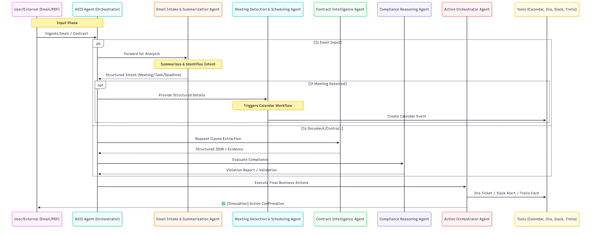

# AXIS - IBM Hackathon 2026

**IBM Hackathon 2026 | Challenge: Agentic AI with watsonx**

> **Axis** is not a chatbot; it is an ecosystem of autonomous agents acting as the connective tissue between static legal contracts and dynamic operational execution.

---

## 🛠️ Repository Content
This repository serves as the documentation and architecture hub for the solution:
* **/workflows**: Flowcharts of the agentic logic and skill orchestration in watsonx Orchestrate.
* **/docs**: Implementation guides and business use cases for the demo.

---

## 📑 Project Overview
In today’s business environment, compliance is often a reactive and manual process. Contracts remain confined in PDF repositories, disconnected from daily billing and communication systems.

**Axis** solves this through **Agentic AI**, transforming passive clauses into active sentinels that:
1.  **Reason** about the legality of an invoice or an email.
2.  **Orchestrate** enterprise tools (Jira, Trello, Slack).
3.  **Act** proactively regarding expiration dates or compliance risks.

* **Video demonstration URL**:

---

## ⚙️ Micro-Agent Architecture
We have implemented a delegation architecture to maximize precision and reduce bias through specialized agents:

### 1. Contract Intelligence Agent (The Reader)
* **Model:** Llama-3.2-90b-vision-instruct.
* **Function:** Vision processing of unstructured documents (PDFs, scans).
* **Output:** Structured data (JSON) containing dates, liability limits, and price adjustment formulas, always linked to a textual citation from the original document. This agent does not make decisions; it extracts facts.

### 2. Compliance Reasoning Agent (The Judge)
* **Logic:** Based on the **ReAct** framework (Reason, Act, Observe).
* **Mission:** Evaluate whether a received invoice or a commitment in an email violates the clauses extracted by the Intelligence Agent.
* **Rigorousness:** Implements a "Mandatory Evidence" protocol. If no clause supports a judgment, the agent declares itself neutral and requests human intervention.

### 3. Email Intake & Summarization Agent (The Analyst)
* **Function:** Specialized in analyzing incoming communications to identify user intent, extract key points, and summarize content into clear bullet points.
* **Role:** Prepares structured data for downstream agents, identifying explicit requests, deadlines, or meeting proposals within raw email text.

### 4. Meeting Detection & Scheduling Agent (The Coordinator)
* **Function:** An action-oriented agent responsible for the precise scheduling of meetings only when explicitly requested.
* **Constraint:** This agent never interprets raw emails directly. It receives structured input from the Analyst agent and triggers calendar workflows to create events and coordinate participants.

### 5. Action Orchestrator Agent (The Executor)
* **Role:** The operational arm within **watsonx Orchestrate**.
* **Action:** Receives structured compliance decisions and translates them into API calls to Slack, Outlook, Jira, and Trello. It focuses exclusively on the integrity of business execution.

---

## 🛠️ Technological Stack
* **AI Platform:** [watsonx.ai](https://www.ibm.com/watsonx)
* **Model:** Llama-3.2-90b-vision-instruct (Multimodal reasoning).
* **Orchestration:** [watsonx Orchestrate](https://www.ibm.com/products/watsonx-orchestrate) utilizing Agentic Workflows.
* **Decision Framework:** ReAct Logic (Reason, Act, Observe).
* **Integrations:** Jira Software, Slack Enterprise, Trello API, Microsoft Outlook/Calendar, Google Drive.

---

## 🛡️ Guardrails and Agent Governance
Axis operates under a set of non-negotiable guidelines configured in its base behavior:

| Condition | Agentic Action |
| :--- | :--- |
| **No Hallucination** | Strict prohibition on inferring terms not present in the document or email. |
| **Evidence-based Decisions** | Every compliance decision must cite the exact paragraph from the governing document. |
| **Financial Safeguard** | Axis flags discrepancies and escalates issues but is forbidden from approving or executing payments. |
| **Conflict Detection** | If contradictory information is found between documents, all actions are suspended until human resolution. |
| **Missing Info Protocol** | If tool inputs (Jira/Trello/Calendar) are ambiguous, Axis will ask a single clear question rather than guessing. |
| **Simulation Mode** | All external actions (emails, tickets, tasks) are explicitly labeled as: `✅ [Simulation] Action completed successfully.` |

---

## 🚀 Demo Flow: From Email to Action
Axis demonstrates its autonomy through the following comprehensive scenario:
1.  **Ingestion:** Receipt of a service contract via Outlook and a follow-up email from a provider.
2.  **Analysis:** The **Email Intake Agent** identifies a meeting request and a project start date.
3.  **Scheduling:** The **Meeting Agent** automatically coordinates the kickoff on the calendar.
4.  **Reasoning:** Axis identifies a 5% annual increase clause in the contract PDF.
5.  **Validation:** Upon receiving a simulated invoice with a 10% increase, Axis detects the violation.
6.  **Enforcement:** Axis cites the 5% increase clause, posts a high-priority alert to **Slack**, and opens a "Disputed" ticket in **Jira**.

---

## 👥 The Team
Developed for the **IBM Hackathon 2026** by:

* **[Santiago Oroz](https://www.linkedin.com/in/santiago-oroz/)** - santiago.oroz1510@gmail.com
* **[Renata Berho](https://www.linkedin.com/in/renata-berho-02264230a/)** - renaberho2@gmail.com
* **[Milagros Argañin](https://www.linkedin.com/in/milagros-arga%C3%B1in-13641a376/)** - miliarganin3@gmail.com

---

*Axis demonstrates how the power of open models in watsonx.ai transforms legal compliance and communication into an automated operational advantage.*
